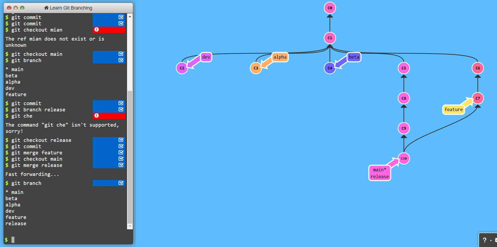
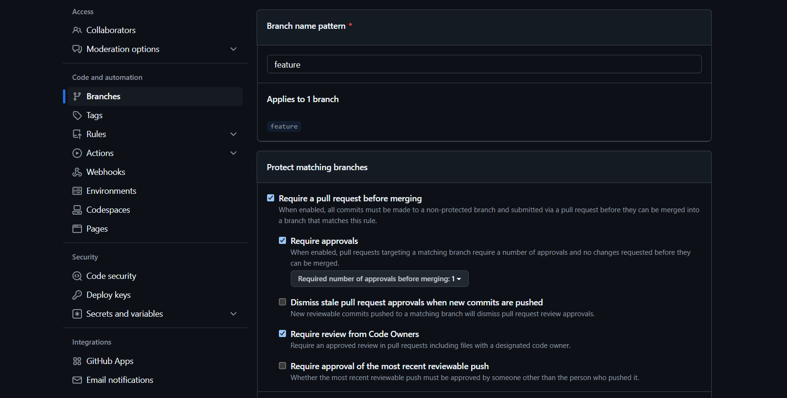
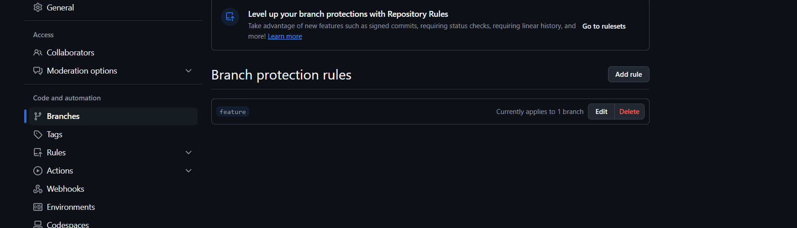
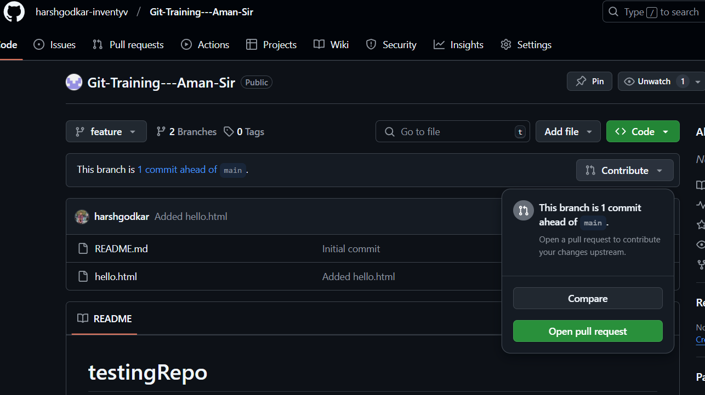
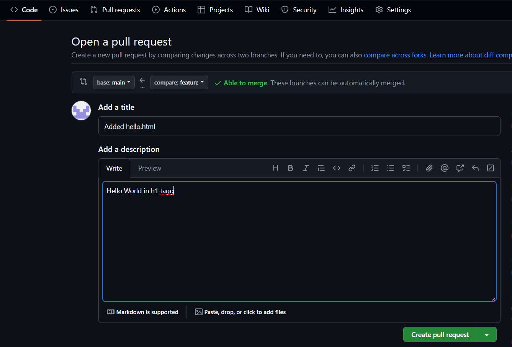
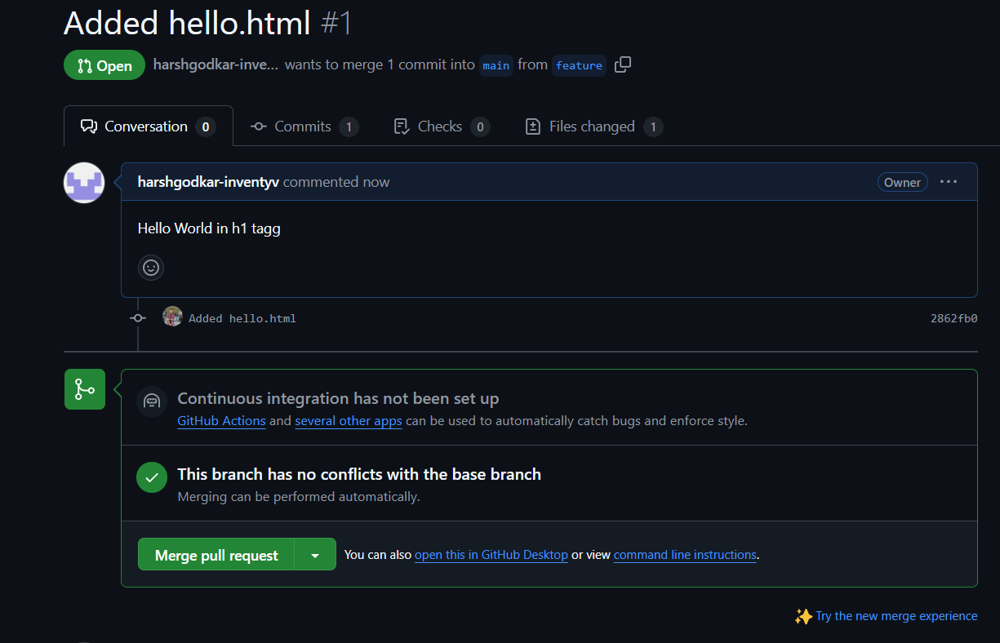

# GitHub Basic

In This section i learned about How to create repo, cloning repo, add files and how to commit in it.

I Also learn about generating token for authentication and configuring git using :

```
git config --global user.name harshgodkar-inventyv
git config --global user.email harsh.godkar.inventyv@gmail.com
```

We need to create a secure store of our credentials using the git credential approve command.


```
git credential approve <<< $'url=https://github.com\nusername=harshgodkar-inventyv \npassword='
```


# GitHub Branches

There are two main different ways to create branches in Git and both of these ways are quite similar to each other. 

```bash
#syntax
git branch <branch_name> 

#example
git branch feature1 #this will create a branch named 'feature1'

#If you wish to see the branches that are available
git branch
```




## Git Flow
 ### Creating 3 branches dev, alpha, beta
 ```
git branch dev
git branch beta
git branch alpha
 ```

 ### made 2 commits in each branch ( one example is given here )


```bash
git checkout alpha
git commit
git commit
```


### made a feature branch from main branch


```bash
git checkout main
git branch feature
git checkout feature
git commit
```


### made a hot-fix in main branch


```bash
git checkout main
git commit
```

### create release branch from main branch

```
git branch release
git checkout release
git commit
```

### merge feature in release branch
```
git merge feature
```

### merge release in main branch
```
git checkout main
git merge release
```


# Github Pull Request
A pull request, often abbreviated as PR, serves as a proposal to merge changes made in one branch of a repository into another, typically from a feature branch into the main branch.











